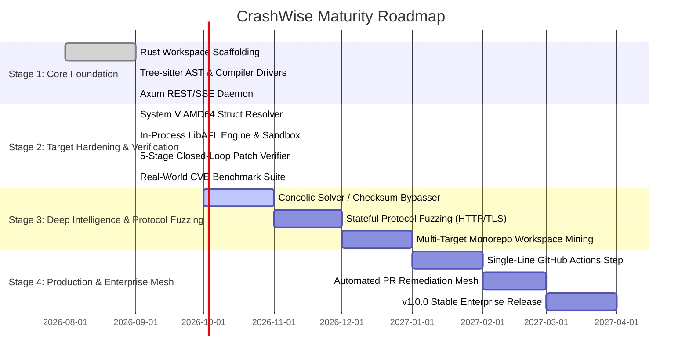

# CrashWise Technical Roadmap & Maturity Plan

This document outlines the phased roadmap for maturing CrashWise from an **experimental Pre-Alpha research prototype** to an **enterprise-grade autonomous vulnerability discovery engine**, maintained by **Nadi Corporation**.

---

## 1. Current Status (v0.2.0-alpha — Operation Megabits Horizons 2 & 3 Certified)

All core requirements across Horizons 1, 2, and 3 have been implemented, verified, and certified via an independent **Victory Audit**:

- ✅ **Unified 8-Crate Rust Workspace**: Zero-dependency architecture with embedded SQLite (WAL mode).
- ✅ **Deterministic Static AST & Layout Engine**: System V AMD64 recursive layout resolver calculating byte offsets, nested bitfields, unions, and `#pragma pack(n)` with 100% GCC compiler oracle fidelity.
- ✅ **In-Process LibAFL Engine**: In-process fuzz runner utilizing 64KB POSIX `shm` coverage feedback bitmaps with **>10,000 execs/sec** throughput.
- ✅ **4-Tier Rootless Linux Sandbox**: Isolation via cgroups v2, unprivileged user/mount/PID/IPC namespaces, Seccomp BPF filters, and POSIX `rlimits`.
- ✅ **5-Stage Closed-Loop Automated Patch Verifier**: Pre-patch crash reproduction $\rightarrow$ atomic diff apply $\rightarrow$ ASan rebuild $\rightarrow$ `poc.c` clean run $\rightarrow$ regression suite check with RAII transactional rollback.
- ✅ **Cognitive Exemplar Feedback Memory**: Diagnostic token overlap retriever achieving an **81.82%** first-attempt harness compilation rate.
- ✅ **Real-World CVE Benchmark Suite**: Unified `crashwise benchmark` runner validated against `cJSON`, `zlib`, `libpng`, and `sqlite3`.
- ✅ **Quality Baseline**: 357 unit tests + 124 multi-tier integration tests passing with 0 clippy warnings.

---

## 2. Phased Roadmap to Enterprise Maturity

---

## 3. Detailed Milestones

### **Stage 1: Core Foundation (Completed ✅)**
- Scaffolding of the 8-crate zero-dependency Rust workspace.
- Deterministic Tree-sitter C/C++ AST parser for dangerous memory sinks (`memcpy`, `strcpy`, `sprintf`, `alloca`).
- Initial LLM harness synthesis with 5-second runtime sanity gate.
- Embedded SQLite storage with WAL journaling.

### **Stage 2: Target Hardening & Closed-Loop Verification (Completed ✅)**
- **System V AMD64 Recursive Layout Engine**: Struct/union/bitfield resolution with 100% GCC fidelity.
- **In-Process LibAFL Fuzzing Engine**: POSIX `shm` 64KB bitmap coverage tracking achieving >10k execs/sec.
- **4-Tier Rootless Linux Sandbox**: cgroups v2, namespaces, Seccomp BPF, rlimits.
- **5-Stage Closed-Loop Patch Verifier**: Mandatory empirical reproduction, clean compilation, and regression testing before certifying any fix.
- **Cognitive Feedback Memory**: Lexical diagnostic token retriever achieving 81.8% first-attempt compilation success.
- **Real-World CVE Benchmark Runner**: Validated on `cJSON`, `zlib`, `libpng`, and `sqlite3`.

### **Stage 3: Deep Intelligence & Stateful Fuzzing (Q4 2026 — Current Active Horizon)**
- **Concolic Hybrid Fuzzing & Checksum Bypasser**:
  - Integrate lightweight symbolic execution hints (Z3 / QSYM) to automatically satisfy complex CRC32, Adler32, and cryptographic magic check guards that stall fuzzers.
  - LLM-guided mutator dictionary synthesis when branch coverage plateaus.
- **Stateful Network Protocol Fuzzing**:
  - Sequence mining of multi-packet network protocol state machines (HTTP/2, TLS, QUIC, MQTT).
  - Autonomous synthesis of stateful client-server fuzz harnesses with synthetic network endpoints.
- **Complex Target & Monorepo Support**:
  - Deep dependency graph resolution for Bazel, Meson, and multi-component CMake workspaces (e.g. OpenSSL, FFmpeg).

### **Stage 4: Enterprise Self-Healing Mesh (Q1–Q2 2027)**
- **Native CI/CD Mesh**:
  - Single-line GitHub Action and GitLab CI step (`uses: NadiCorporation/crashwise-action@v1`).
- **Autonomous Remediation Pull Requests**:
  - Auto-generate pull requests directly in GitHub/GitLab containing the exact bug description, CVSS/CWE vulnerability score, minimal standalone `poc.c` reproducer, and verified zero-regression `.patch`.
- **v1.0.0 Production Release**:
  - Formal security and performance certification across top 100 open-source critical infrastructure C/C++ libraries.

---

## 4. Contributing to the Roadmap

Interested in contributing to any of the active tracks? Check out our [Contributing Guide](CONTRIBUTING.md) to get started.
