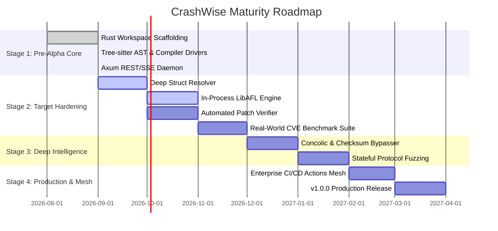

# CrashWise Technical Roadmap & Stabilization Plan

This document outlines the phased roadmap for maturing CrashWise from an **experimental Pre-Alpha research prototype** to an **enterprise-grade autonomous vulnerability discovery engine**.

---

## 1. Current Status (v0.2.0-dev — Operation Megabits)

- ✅ **Unified Rust Workspace**: 8 core modular crates (`crashwise-core`, `crashwise-ast`, `crashwise-build`, `crashwise-agent`, `crashwise-engine`, `crashwise-triage`, `crashwise-server`, `crashwise-cli`).
- ✅ **Deterministic Static AST Mining**: Tree-sitter C/C++ parser extracting public APIs, callgraphs, and reachability to dangerous memory sinks in milliseconds.
- ✅ **Multi-Build System Drivers**: Automated Clang instrumentation (`-fsanitize=address,undefined`) for CMake, Meson, Make, and Autotools.
- ✅ **Closed-Loop Cognitive Synthesis**: LLM harness generator with compiler error self-healing and 5-second runtime sanity gate.
- ✅ **Standalone PoC Generator**: Autonomous synthesis of compilable C Proof-of-Concept reproducer files (`poc.c`).
- ✅ **Embedded SQLite & Control Plane**: Axum REST API server with real-time SSE telemetry and standalone Next.js 15 Web Command Center.

---

## 2. High-Focus & Stabilization Priorities

Before graduating from Pre-Alpha to Beta, the following core subsystems must be hardened and stabilized:

| Focus Area | Subsystem | Current Limitation | Target Implementation | Priority |
| :--- | :--- | :--- | :--- | :---: |
| **Deep Struct Layouts** | `crashwise-ast` | Complex nested structs & typedef pointers sometimes require manual header lookups. | Implement recursive Tree-sitter type resolver to extract full field offsets and struct definitions. | 🔴 High |
| **In-Process LibAFL Engine** | `crashwise-engine` | Subprocess-based libFuzzer execution adds process management overhead. | Integrate native in-process `LibAFL` runner with shared-memory coverage feedback bitmaps (`shm`). | 🔴 High |
| **Automated Patch Verification** | `crashwise-triage` | Generates `.patch` candidates but requires manual review. | Build closed-loop patch verification engine: Apply patch $\rightarrow$ Recompile with ASan $\rightarrow$ Replay PoC $\rightarrow$ Verify zero crash & regression test passes. | 🔴 High |
| **Fuzzing Blocker Breaker** | `crashwise-agent` | Hard checksums (CRC32, MD5) and magic value guards can stall fuzzer coverage. | Implement concolic execution / symbolic analysis hints and LLM mutator dictionary synthesis when coverage plateaus. | 🟡 Medium |
| **Bazel & Cargo Drivers** | `crashwise-build` | Currently supports CMake, Meson, Make. | Add native build executors for Bazel monorepos and Rust Cargo crates. | 🟡 Medium |

---

## 3. Phased Roadmap to Maturity

### **Stage 1: Core Foundation (Completed)**
- Replace legacy prototype with 8-crate Rust workspace.
- Implement AST callgraphs, sanitizer compiler drivers, LLM compiler feedback loop, and embedded SQLite control plane.

### **Stage 2: Real-World Hardening & Validation (Q4 2026 — Next Priority)**
- **Target Hardening**: Stress test on standard fuzzing benchmarks:
  - `cJSON` (CMake, C)
  - `zlib` (Make/CMake, C)
  - `libpng` (CMake/Autotools, C)
  - `libxml2` (Autotools/CMake, C)
  - `sqlite3` (Amalgamation Make, C)
- **Validation Criteria**: Must autonomously synthesize working harnesses that achieve $> 60\%$ branch coverage and successfully discover seeded/known CVEs without manual intervention.

### **Stage 3: Advanced Intelligence & Blockers (Q1 2027)**
- **Concolic Hybrid Fuzzing**: Integrate symbolic solvers to bypass complex branching guards and CRC checks.
- **Protocol State Machines**: Deep analysis of multi-packet network protocols (e.g., HTTP/2, TLS, QUIC) to synthesize stateful client-server fuzzing harnesses.

### **Stage 4: Enterprise Self-Healing Mesh (Q2 2027)**
- **CI/CD Integrations**: Single-line GitHub Action / GitLab CI pipeline steps (`uses: crashwise/action@v1`).
- **Automated Pull Request Remediation**: Auto-generate PRs containing the exact bug description, CVSS score, PoC reproducer, and verified `.patch` fix.
- **v1.0.0 Stable Release**: Tag first official production-ready release after passing extensive enterprise security audits.
